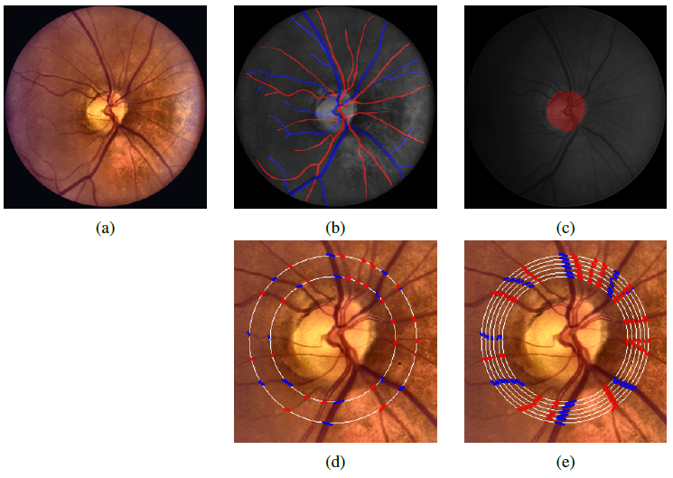

# AVR_calculation

This is a Python application that calculates the arteriovenous ratio (AVR) measurement, from 1DD to 1.5DD, in a fundus image by using `Streamlit` as its interface. This project is part of the thesis _"Early Hypertensive Retinopathy detection by levaraging salient regions using Deep Learning"_, which was done in collaboration with:

* _UAQ_ - Universidad Autónoma de Queretaro
* _INDEREB_ - Instituto Regional de la Retina del Bajío
* _CONACYT_ - Consejo Nacional de Ciencia y Tecnología

To run this app:
```
streamlit run streamlit_app.py
```

## Overview

This tool needs the original fundus image, the OD label and the A/V classification that a model has previously predicted. This project used an improved `U-net`.  After all images have been uploaded and the user has decided if all images are to be displayed, the user only need to click on Calculate to obtain the results. An example is shown.

<p align="center">
    
</p>

## Background

This application designates the ROI, which is the area that delimits where the vessels’ width will be measured, the same way as stated in _“Automated measurement of the arteriolar-to-venular width ratio in digital color fundus photographs”_ by Niemeijer et al. The width of arteries and veins crossing at the established circumferences are measured in steps of 0.1 from the lower diameter to the upper one. It is important to note that since all vessels have been previously classified, the system measures them all with a technique named ConvexHull.

<p align="center">
  
</p>

During each step, the application compares all resulting widths and selects the 6 widest arteries for CRAE calculation, and then selects the 6 widest veins for CRVE calculation. After both CRAE and CRVE have been calculated, an AVR measure is. Once all steps have been completed, each corresponding AVR result is averaged to deliver a final value. The equations used in this tool were initially proposed by Knudtson et al. and are shown below.

$$ CRAE = 0.88 \sqrt{{W_1}^2 + {W_2}^2} $$

$$ CRVE = 0.95 \sqrt{{W_1}^2 + {W_2}^2} $$

where $W_1$ represents the narrowest artery and $W_2$ the widest, the process is repeated until a remaining vessel is carried over the final iteration to the derive its correponding CRAE or CRVE and finally calculte the AVR.

$$ AVR = \frac{CRAE}{CRVE} $$

## Test images

This repository provides a total of 6 sets of images to test the Streamlit application, each of those consists of 3 images: the original fundus, its OD and A/V classification, as can be seen below.

`DATASET: INDEREBv1`

<p align="center">
     
</p>
<p align="center">
     
</p>
<p align="center">
     
</p>

`DATASET: INDEREBv2`

<p align="center">
     
</p>
<p align="center">
     
</p>
<p align="center">
     
</p>
